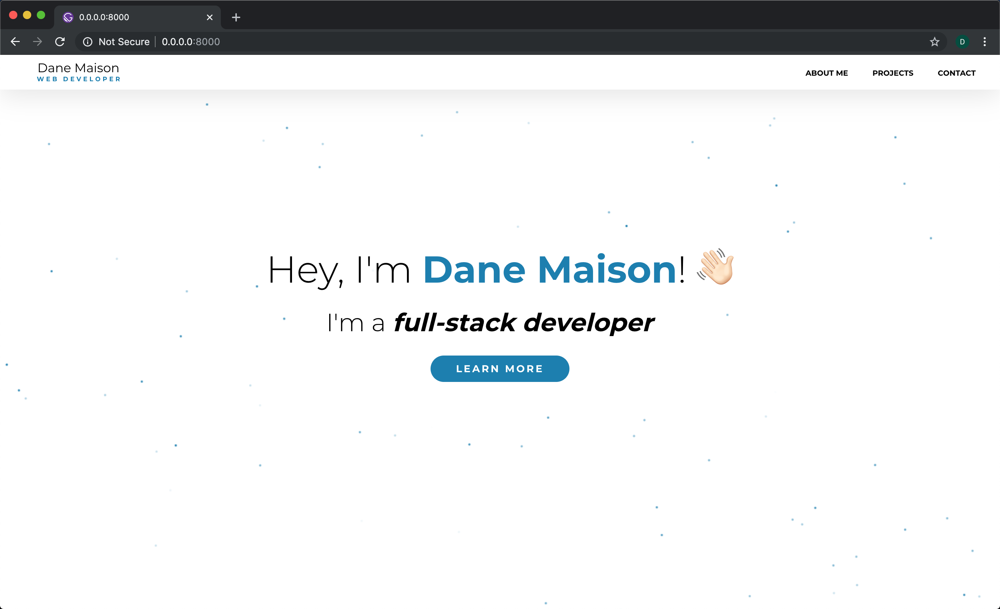

# Description

A portfolio site I created for myself. I decided to use Gatsby for its preformance and SEO benefits. By using GraphQL to pull data from markdown files, I'm able to update the content on the site whenever I need to add or change anything!

# Live Site

Check it out at https://danemaison.com

# Technologies Used

- React
- Gatsby
- GraphQL
- Styled Components
- react-spring
- Canvas

# Preview

